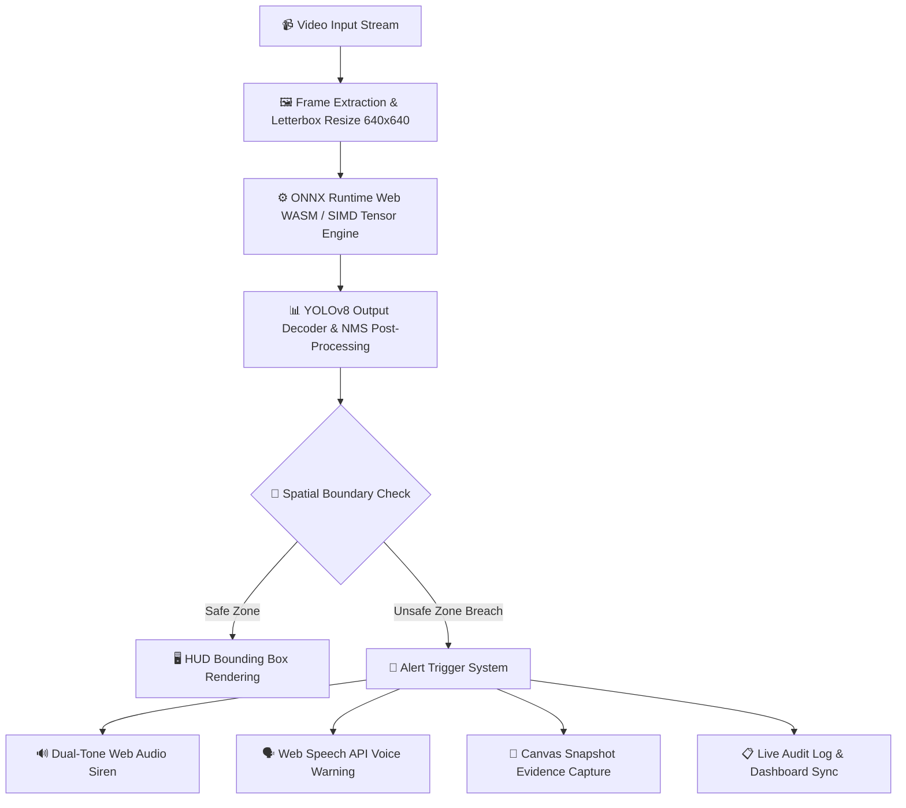

# 🛡️ Sentinel-Edge PPE Monitor

> **Industrial Edge AI for Personal Protective Equipment (PPE) & Restricted Zone Monitoring**  
> *Zero-Cloud · Real-Time WebAssembly ONNX Inference · Offline PWA · On-Device Audio Alarms*

[](LICENSE)
[]()
[]()
[]()

---

## 🌟 Executive Overview

**Sentinel-Edge PPE Monitor** is a state-of-the-art, zero-latency computer vision safety platform designed for industrial facility monitoring, hazardous work zones, and construction sites. 

Operating entirely on-device via **WebAssembly SIMD** and **ONNX Runtime Web**, Sentinel-Edge eliminates the need for expensive GPU cloud infrastructure, external APIs, or continuous internet access. Video frames from local webcams or IP cameras are analyzed directly inside the browser engine, ensuring **100% data privacy**, **zero cloud bandwidth overhead**, and **instantaneous threat detection**.

---

## 🏗️ System Architecture



---

## 🔥 Key Technical Capabilities

### 1. ⚡ On-Device Edge AI Inference
- **Zero Cloud Dependence**: Powered by `@onnxruntime/web` using standard YOLOv8 tensor output shapes `[1, 4 + numClasses, 8400]`.
- **Hardware Acceleration**: Automatically utilizes browser WASM multi-threading and SIMD vector instructions.
- **Performance Telemetry**: Real-time Heads-Up Display (HUD) measuring per-frame latency ($ms$) and throughput ($FPS$).

### 2. 🎯 Dynamic Unsafe Restricted Zone Geofencing
- **Interactive Boundary Tooling**: Click-and-drag or touch interface allowing site inspectors to draw polygon restricted zones directly on live video feeds.
- **Normalized Spatial Intersections**: Bounding box center-point verification ($c_x, c_y$) against active spatial coordinates in real time.

### 3. 📸 Automated Evidence Snapshot Engine
- **Instant Watermarking**: Automatically renders high-resolution JPEG evidence captures upon any zone breach.
- **Audit Trails**: Embedded timestamps (ISO 8601), bounding box overlays, confidence metrics, and zone highlight paths for legal and safety compliance audit compliance.

### 4. 🔊 Industrial Alarm & Voice Warning System
- **Dual-Tone Cyber Siren**: Custom Web Audio API oscillator sweeping frequency ramps ($880\text{ Hz} \rightarrow 440\text{ Hz}$) generated on-device with zero audio sample downloads required.
- **Web Speech API Voice Synth**: Native text-to-speech engine issuing clear verbal announcements (*"Warning! Restricted zone breach detected. Object: [class]"*).
- **Debounced Cooldown Matrix**: 3-second smart alert debouncing prevents audio overlap during sustained violations.

### 5. 📴 Progressive Web App (PWA) Offline Engine
- **Service Worker v4 Caching**: Caches static assets, WebAssembly runtimes, and local ONNX model weights (`sw.js`).
- **Network Resilience**: Operates flawlessly in remote field locations with zero cellular or Wi-Fi connectivity.

---

## 🛠️ Technology Stack

| Layer | Technology | Purpose |
| :--- | :--- | :--- |
| **Frontend Framework** | React 18, Vite 5 | Modular component architecture & ultra-fast build engine |
| **Inference Engine** | ONNX Runtime Web (`onnxruntime-web`) | On-device execution of YOLOv8 neural models |
| **Styling System** | Custom Industrial Glassmorphism CSS | High-contrast visual telemetry HUD & dashboard |
| **Audio & Speech** | Web Audio API, Web Speech Synthesis API | Synthetic siren alarms & verbal announcements |
| **PWA & Offline** | Service Workers, Web App Manifest | Full standalone installation & offline caching |
| **Sync Layer (Optional)** | Node.js, Express, Docker | Centralized detection aggregation for connected environments |

---

## 🚀 Quick Start & Local Setup

### Prerequisites
- **Node.js**: `v18.0.0` or higher
- **npm**: `v9.0.0` or higher

### Installation

```bash
# 1. Clone repository
git clone https://github.com/subhradeepkundu270305/sentinel-edge-ppe-monitor.git
cd sentinel-edge-ppe-monitor

# 2. Install dependencies
npm install

# 3. Start local development server
npm run dev
```

Open `http://localhost:5173/` in Google Chrome, Microsoft Edge, or Safari, and allow camera access when prompted.

---

## 🧠 Model Training & Custom Export Guide

Sentinel-Edge is pre-configured to load local ONNX models located at `public/models/model.onnx`.

### 1. Export Pre-Trained YOLOv8 Spike Model
To immediately test the execution pipeline using standard COCO object classes (e.g. `person`):

```bash
pip install ultralytics
python -c "from ultralytics import YOLO; YOLO('yolov8n.pt').export(format='onnx')"
# Move the generated yolov8n.onnx file:
cp yolov8n.onnx public/models/model.onnx
```

### 2. Custom Industrial PPE Model Export
When training your custom dataset (e.g. `['helmet', 'no-helmet', 'vest', 'no-vest', 'gloves', 'boots']`) in Roboflow or Google Colab:

```python
from ultralytics import YOLO

# Load your custom trained PyTorch weights
model = YOLO('runs/detect/train/weights/best.pt')

# Export to ONNX format with 640x640 input resolution
model.export(format='onnx', imgsz=640, dynamic=False)
```

### 3. Update Class Name Mapping
Update the `CLASS_NAMES` list inside `src/utils/postprocess.js` to match your custom trained labels in exact sequence:

```javascript
// src/utils/postprocess.js
export const CLASS_NAMES = [
  'helmet',
  'no-helmet',
  'vest',
  'no-vest',
  'gloves',
  'boots'
];
```

---

## 🐳 Optional Centralized Sync Backend (Docker)

For centralized auditing environments where edge devices sync alerts upon re-establishing connection:

```bash
# Build Docker image
cd docker
docker build -t sentinel-analytics .

# Run Express analytics container on port 4000
docker run -d -p 4000:4000 --name sentinel-edge-sync sentinel-analytics
```

---

## 🔒 Security & Privacy Compliance

- **Zero Camera Streaming**: Video feeds are processed entirely inside volatile RAM via HTML5 `<video>` and `<canvas>` elements. No video or frame buffer is ever transmitted to an external server.
- **Air-Gapped Operation**: Designed specifically for defense, healthcare, and high-security industrial sites requiring strict air-gapped compliance.

---

## 📄 License

Distributed under the **MIT License**. See `LICENSE` for details.
